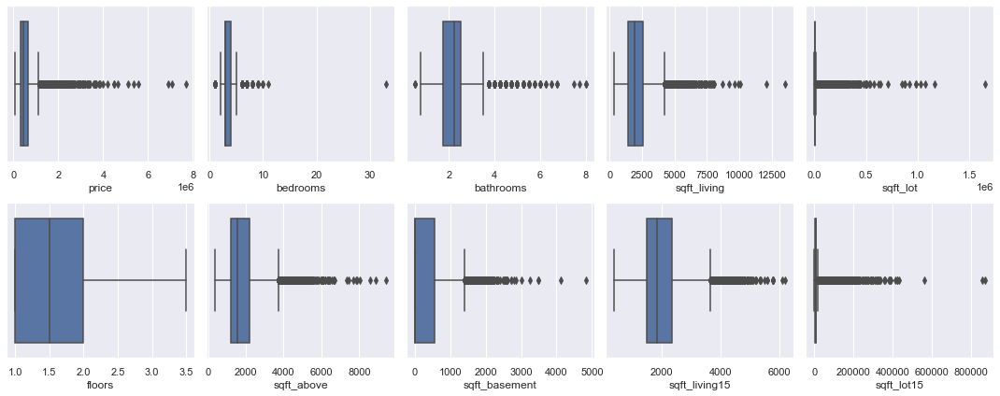
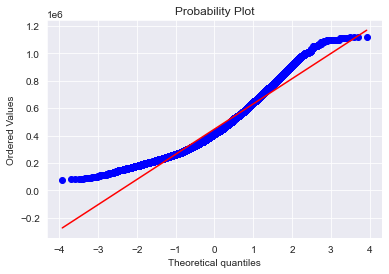
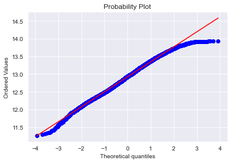
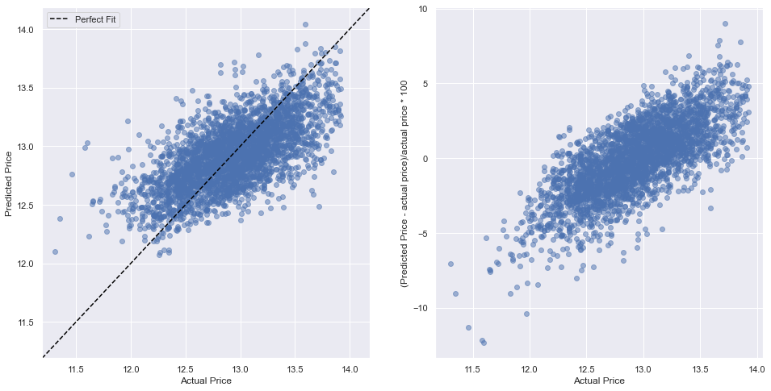
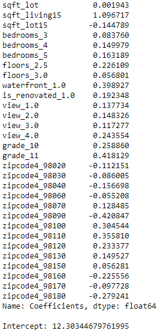

# Phase 2 Project

## Project Overview

This project analyzes house sales data in a northwestern county using regression model.

## Business Problem

After buiding the regression model, the features that are closely related to house price will be identified. 

Therefore, some suggestions could be given to both the buyers and sellers.

* For the buyer, they will know the price of the house based on the characteristics of the house, and also, what's the investment value for the house.

* For the seller, they may know whether they can do something to sell the house with a better price.

## Data

This project uses the King County House Sales dataset, which can be found in  `kc_house_data.csv` in the data folder in this repo. 
The description of the column names can be found in `column_names.md` in the same folder.

## Methods
First, I loaded data to check the potential features, and found:
1) There are potentially 19 predictors excluding the id and the target,i.e.,the price
2) A total of 21597 rows, while some rows have null values in some predictors
3) Several predictors' data type need to be changed

Second, I prepare the data by 
1) dealing with datatyepes for sqft_basement & date
2) dealing with the missing values in waterfront, view, yr_renovated, sqft_basement
3) dealing with outerliers (see the following figures for the data before and after removing outliers)

And finally the histogram of all features are shown below

For the zip code, I only keep the first four digits since if I only keep the first three digits,it will only have two zipcodes
And the visualization of categorical variables are shown in the following figure
[figure of categorial variables](Figs/boxplot_categorialvar.png)

### Modeling
After finishing the data preparation, now I start to build the regression model
I drop id, date, yr_renovated,lat, long, zipcode from df since:
1) the id has not related to the house price
2) the date has been transformed into sold_year and sold_month
3) the yr_renovated has been transformed into is_renovated
4) the lat and long indicate similar information as zipcode
5) zipcode has been transformed into zipcode4 and dummy variables

I also scale individual features in the same scale

For the target, i.e., price, I performed a transformation: log10(1+price), to make it more normal distribution(see the following figures)

original price

after transformation

Now I conducted linear regression modeling. I firstly used all features and found the transformed price has a little better R-squared value. 
Therefore, I used it as the target for subsequent analysis.

After removing the insignificant Features, and features with collinearity, I obtained the final model shown as below:

The model's normality is shown as

And the homoscedasticity is

### Evaluation
To evaluate the model, I calculated the score for both train and test data, and found they are similar:
Test score:   0.44378007421545485
Train score:  0.44859642929281374

I also used cross validation to evaluate the model and found that they are similar
Train score:      0.44648159473484395
Validation score: 0.4500640604866031

I also calculated mean squared error, root mean squared error, and Mean absolute error:
MSE:        0.08275149712742216
RMSE:       0.28766559948562176
MAE:        0.22861402157360175
R-Squared:  0.5432593071160836

and the comparision of predicted and real values

From above values and plots, the fitted regression model can predict house price very well

## Summary
The coefficients of the selected features are:

### From coefficients described above, I observed:
1) The grade and sqft_living15 have the strongest relationship with the house price
2) It is interesting to see the sqft_lot15 has the negative relationship with the house price
### To address the business question:
1) For buyer, they will know the house price is higer for a house with high grade and sqrt_living15
2) For seller, if they want to sell their house with a higher price, they could add waterfront, improve the grade/condition.
